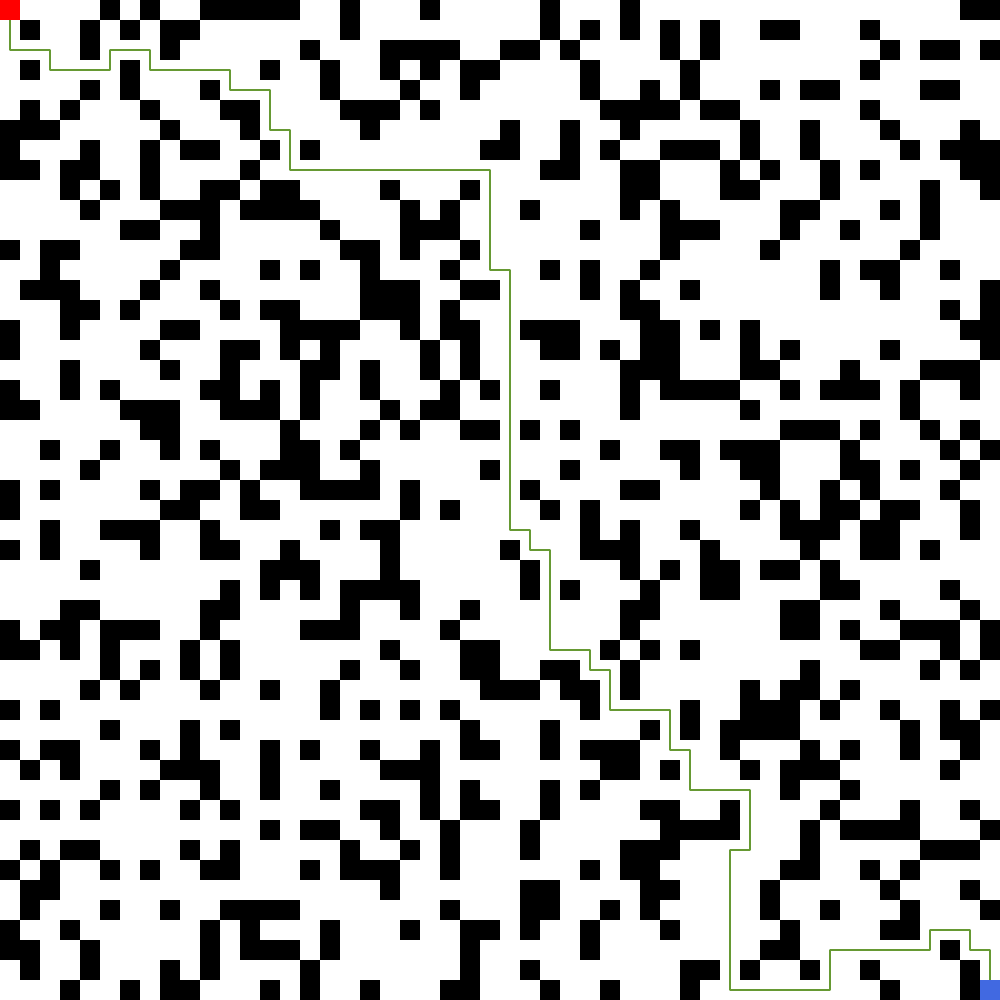

# A\* search algorithm

[](https://godoc.org/github.com/Jxtopher/a_star/)


## Setup

Install with

```
make install
```

Run the program with:

```
make run
```

## Test

Run all tests with:

```
make test
```

Or specific tests with:

```
make test TARGET=path/to/what/should/be/tested
```

## Example result


